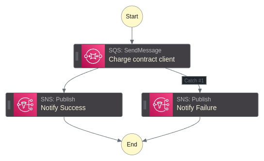

# aws-step-functions-wait-for-callback-poc
AWS Step Functions state machine using the wait-for-callback Pattern. The SQS queue receive a data, pause the flow meanwhile the generated token is saved on DynamoDB. A third-party user calls a REST API
through AWS API Gateway, gets the token, solve the problem and then post the token back to the AWS Step Functions API, continuing the flow to the end.

